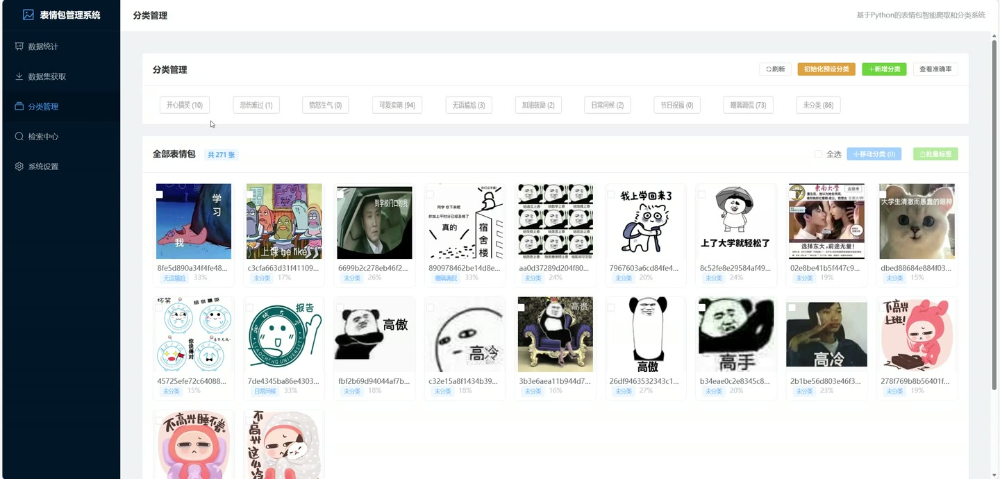
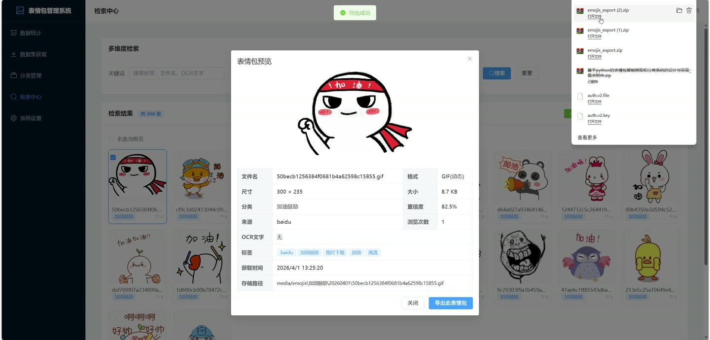

# (附文档)Python+Django+PyTorch 基于python的表情包智能爬取和分类系统

**技术栈**：Python、Django、PyTorch、深度学习、Vue3、MySQL

### 系统简介

本系统是一套基于 Python 的表情包智能爬取与分类管理平台，采用前后端分离架构。后端使用 Django + Django REST Framework 提供接口，结合 PyTorch 深度学习模型完成表情包自动分类；前端使用 Vue3 + Element Plus 构建可视化管理界面。系统围绕表情包数据集的获取、预处理、自动分类、检索、导出与系统运维，划分为管理员端与普通用户端两类角色。
 
### 核心功能
 
### 管理员端

 
- 创建爬取任务：填写搜索关键词、目标数量、图片类型，提交后异步启动后台爬取流程。 
- 查看爬取任务列表：分页展示任务ID、关键词、类型、目标数量、状态、已爬取数量、去重数量、格式转换数量、尺寸标准化数量、最终入库数量与创建时间。 
- 查看任务详情：展示单次任务的预处理统计明细，并列出本次爬取到的表情包缩略图预览。 
- 任务状态自动刷新：对处于等待、爬取中、预处理中、分类中的任务每 5 秒自动刷新列表状态。 
- 初始化预设分类：一键初始化社交场景预设分类，用于覆盖基础分类体系。 
- 新增分类：填写分类名称与描述，创建新的表情包分类。 
- 更新分类：修改分类名称、描述及启用状态，支持启用/禁用切换。 
- 删除分类：删除分类后其下表情包自动移入“未分类”，并同步更新计数。 
- 查看分类准确率：基于置信度阈值统计已分类表情包的准确率、正确数、总数及每个分类的分布明细。 
- 手动触发模型训练：合并基础训练集与数据库中已分类表情包进行训练，返回使用数据量与覆盖分类数。 
- 批量移动分类：勾选多张表情包后统一移动到指定目标分类，并自动重算新旧分类计数。 
- 批量更新标签：对选中表情包执行标签添加、移除或替换操作。 
- 单张标签维护：在详情弹窗中为单张表情包添加或移除标签。 
- 导出表情包：将选中表情包打包为 ZIP，可选择是否附带文件名、分类、标签、OCR文字、获取时间等标签信息文本。 
- 批量删除表情包：勾选多张表情包后逐条删除，同时删除本地文件并更新分类计数。 
- 查看数据统计：展示表情包总数、分类数量、存储占用、今日新增，以及各分类占比饼图与近 7 天获取趋势柱状图。 
- 查看热门排行：按预览次数展示 Top 10 热门表情包并支持点击预览。 
- 查看存储信息：展示存储根目录、总占用、文件总数，以及按分类统计的数量、占用空间与占比进度条。 
- 系统配置管理：编辑存储根目录、静态图标准化尺寸、GIF 最大尺寸等配置项并保存，支持初始化默认配置。 
- 日志管理：按类型与时间范围筛选系统日志，查看日志级别与内容，支持清空日志。 
- 系统重置：一键清空表情包、爬取任务与日志数据，并重新初始化分类，返回清除数量统计。
 
### 普通用户端

 
- 多维度检索：按关键词模糊匹配文件名、标签、OCR文字与来源，结合分类、类型、排序条件筛选表情包。 
- 类型筛选：支持仅查看静态图片或仅查看动态 GIF。 
- 排序切换：支持按最新获取或热门程度排序。 
- 分页浏览：支持每页 20/40/60/100 条切换与页码跳转。 
- 查看表情包详情：展示文件名、格式、尺寸、大小、分类、置信度、来源、浏览次数、OCR文字、标签、获取时间与存储路径，并自动累加预览次数。 
- 单张导出：在详情弹窗中一键导出当前表情包并附带标签信息。 
- 勾选与全选：支持单张勾选、当前页全选，用于批量导出或删除。 
- 分类浏览：在分类管理页按分类标签筛选并查看该分类下的表情包网格。 
- 查看分类计数：分类标签实时显示各分类下的表情包数量与启用状态。
 
### 技术栈

 后端框架Django + Django REST Framework 深度学习PyTorch（表情包自动分类模型、置信度评估、模型训练） ORMDjango ORM（Q 对象模糊查询、Count/Avg 聚合、TruncDate 时间分组） 分页组件DRF PageNumberPagination（默认 20 条，最大 100 条） 数据库MySQL 前端框架Vue3（Composition API + script setup） UI 组件库Element Plus 前端路由Vue Router（createWebHistory） 图表库ECharts（饼图、柱状图） HTTP 客户端Axios（统一 baseURL、拦截器、blob 响应） 构建工具Vite
 
### 交付内容

 
- 后端完整源码 
- 前端完整源码 
- 数据库初始化脚本 
- 万字文档

## 界面展示

---

## 获取完整源码 + 万字文档

本仓库为项目介绍页。**完整前后端源码、数据库初始化脚本、万字项目文档**，请加微信 `kangkangcode`，或访问 [codekk.top](http://codekk.top) 获取。

可作课程设计 / 毕业设计参考，支持远程部署调试。